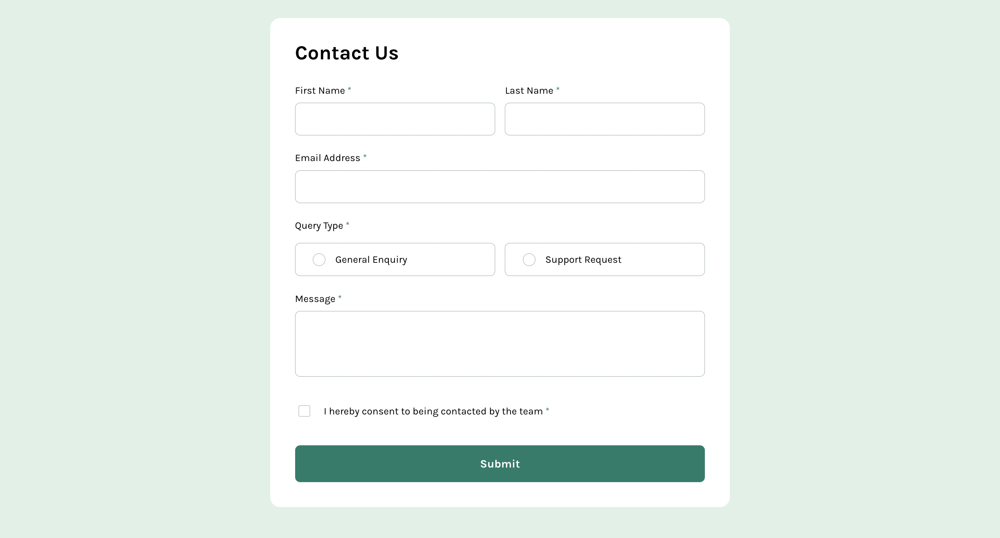

# Frontend Mentor - Contact form solution

This is a solution to the [Contact form challenge on Frontend Mentor](https://www.frontendmentor.io/challenges/contact-form--G-hYlqKJj). Frontend Mentor challenges help you improve your coding skills by building realistic projects.

## Table of contents

-   [Overview](#overview)
    -   [The challenge](#the-challenge)
    -   [Screenshot](#screenshot)
    -   [Links](#links)
-   [My process](#my-process)
    -   [Built with](#built-with)
    -   [What I learned](#what-i-learned)
    -   [Continued development](#continued-development)
    -   [Useful resources](#useful-resources)
-   [Author](#author)

## Overview

### The challenge

Users should be able to:

-   Complete the form and see a success toast message upon successful submission
-   Receive form validation messages if:
    -   A required field has been missed
    -   The email address is not formatted correctly
-   Complete the form only using their keyboard
-   Have inputs, error messages, and the success message announced on their screen reader
-   View the optimal layout for the interface depending on their device's screen size
-   See hover and focus states for all interactive elements on the page

### Screenshot



### Links

-   Solution URL: [Solution URL](https://github.com/Joshk7/contact-form)
-   Live Site URL: [Live Site URL](https://contact-form-nine-vert.vercel.app)

## My process

### Built with

-   Semantic HTML5 markup
-   CSS custom properties
-   Flexbox
-   CSS Grid
-   Mobile-first workflow

### What I learned

I learned how to add custom errors using aria attributes on semantically correct html tags. Every input is structured similarly in that they are all required and have text to describe if an input is required.

```html
<label class="name__label" for="given-name"
    >First Name
    <span class="required" aria-hidden="true"> *</span>
    <span class="sr">required</span>
</label>
...
<span class="error invisible" id="error_given">This field is required</span>
```

The \* is for those who visually scan the contact form and the sr class required tag is for screen readers to read the first name label as required.

Additionally, I learned how to use Web3 forms integrated into my javascript file to receive emails.

### Continued development

Right now I don't have a message whenever there is an error with the http post request being sent with a successful submission of the contact form. I'd possibly add a popup that shows when an error occurs.

### Useful resources

-   [Creating contact forms](https://www.youtube.com/watch?v=-HeadgoqJ7A) - This video shows how to create a contact form and explains how to integrate web3 forms into a project.
-   [Web3 forms](https://web3forms.com) - Web3 forms is the resource that makes this solution functional and sends a message to whatever email you set it up with.

## Author

-   Website - [Joshua Kahlbaugh](https://joshuakahlbaugh.pages.dev/)
-   Frontend Mentor - [@Joshk7](https://www.frontendmentor.io/profile/Joshk7)
